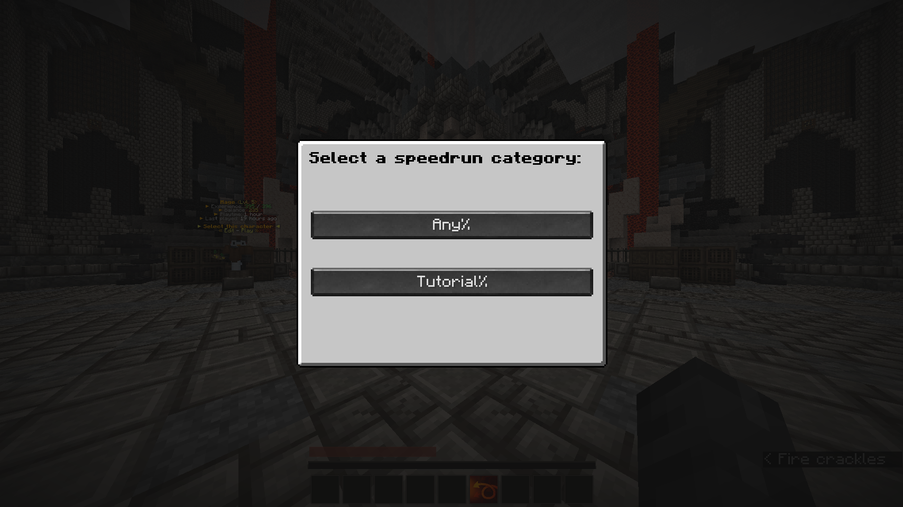
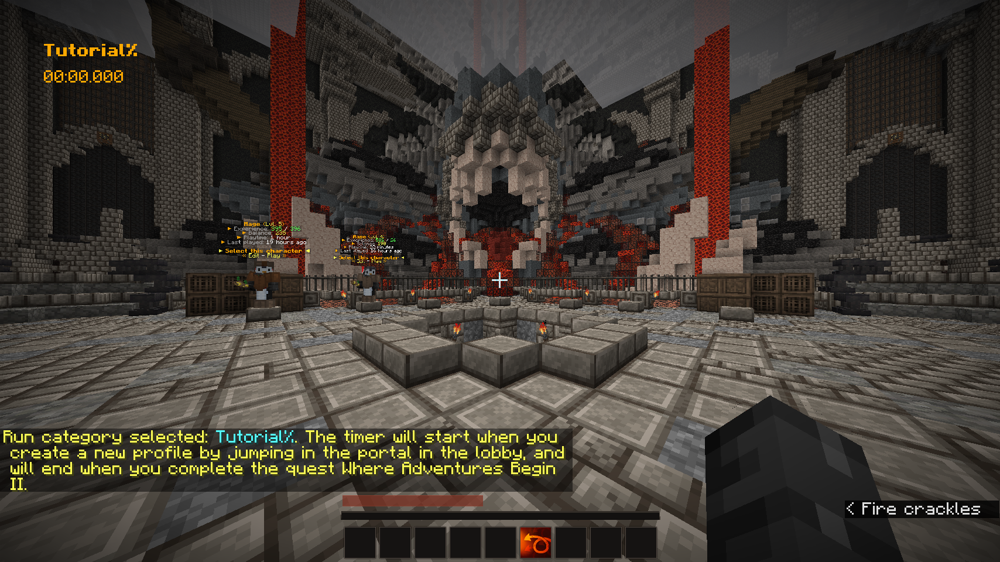
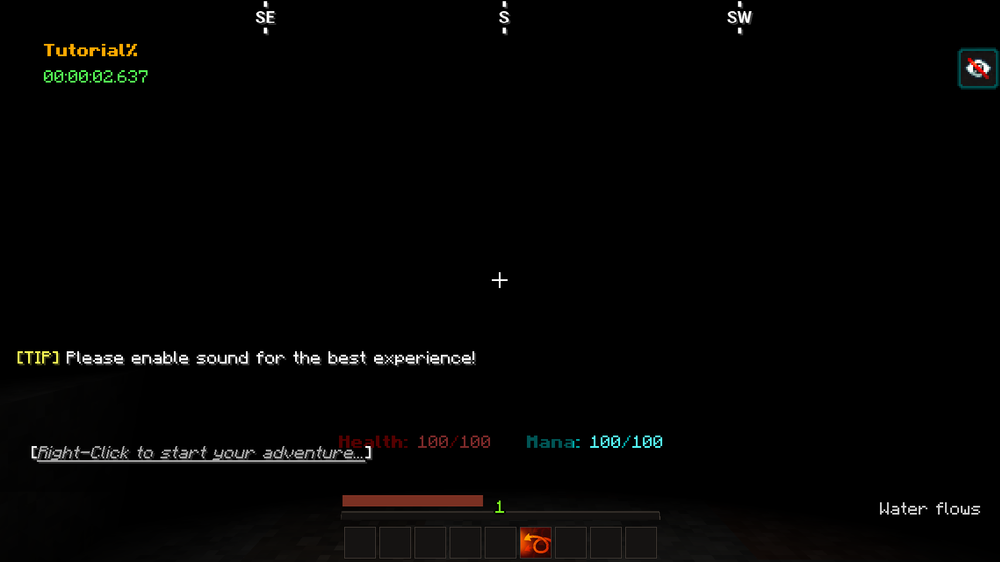

# Dyescape Speedrun Timer

Most game speedruns use a timer that directly hooks into the game in order to get the most accurate timings. This mod does exactly that, but for Dyescape. Simply press O (or a key of your choice), choose your speedrun category, jump in the portal and the clock will start.

## Installation and usage

1. Install [Fabric](https://fabricmc.net/) and the [Fabric API](https://www.curseforge.com/minecraft/mc-mods/fabric-api).
1. Download the latest release from the [Release Page on Github](https://github.com/NoahvdAa/DyescapeSpeedrunTimer/releases).
1. Start the game and join Dyescape.
1. Press O to open the run category selection screen. At the time of writing this, the following categories are available:
	- Any%: Complete all *Where Adventures Begin* quests.
	- Tutorial%: Complete *Wherre Adventures Begin I & II*
1. After selecting a category, jump in the portal in the lobby to start the timer. The timer will end automatically once you complete the last quest necessary for your run.

If you want to use a different key for opening the run selection screen, just go to the Minecraft Controls settings and scroll down to *Dyescape Speedrun Timer*.

## Screenshots

## How is starting/stopping a run detected?

After selecting a run category, the mod will check incoming chat messages for the start or end trigger for that run category. You can check the triggers used [here](https://github.com/NoahvdAa/DyescapeSpeedrunTimer/blob/master/src/main/java/me/noahvdaa/dyescapetimer/SpeedrunCategory.java). All messages are matched exactly, so messages sent by players won't count.

## I found a bug!

You can report bugs on the [Issues Page on Github](https://github.com/NoahvdAa/DyescapeSpeedrunTimer/issues).